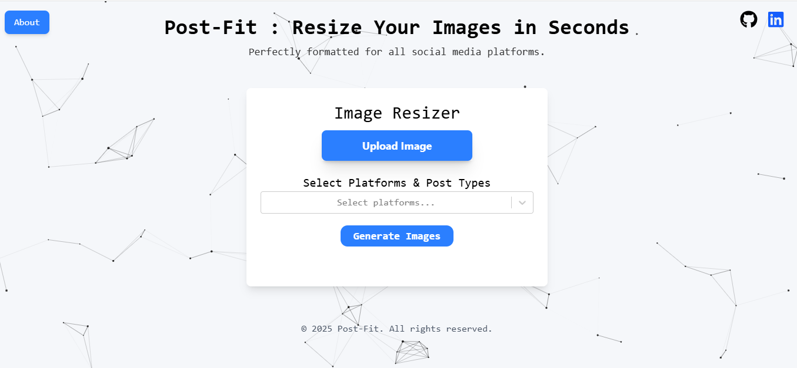

# Post-Fit : Effortlessly convert image aspect ratios for social media

Post-Fit is a sleek, responsive web app that effortlessly converts images to the perfect aspect ratios for all major social media platforms.
Built with a clean UI, smooth animations, and an elegant animated background — making image resizing feel seamless and stylish.

## Screenshots

## Features

- Change image aspect ratios effortlessly
- Presets for Instagram, LinkedIn, Twitter, and more
- Clean, responsive UI with modern design
- Animated background using HTML5 Canvas

## Tech Stack

React, TailwindCSS, Native Canvas API

## Demo

👉 [Live Demo Here](https://post-fit.vercel.app/)

## 🧑‍💻 Author

Made with ❤️ by **[@RahulGarg](https://github.com/Rahulgarg405)**
